# i have asked namecheap for glue records ~30 times. they just told me how to leave.

<div class="scroll-container">
  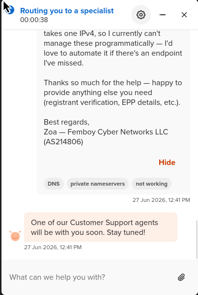
  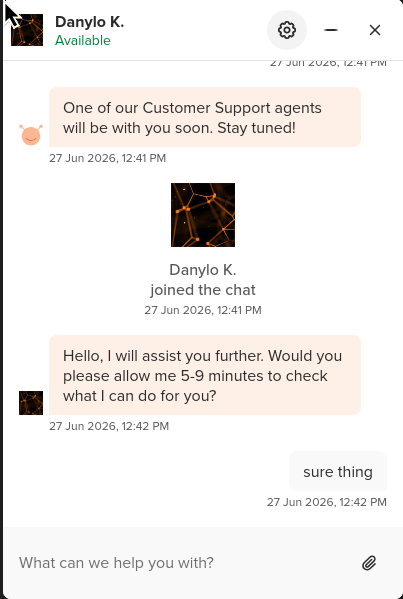
  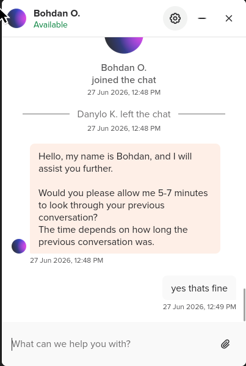
  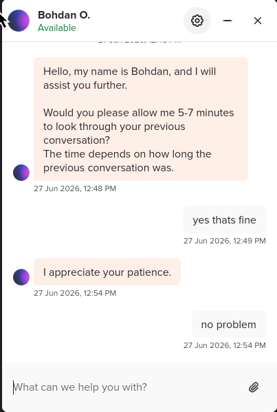
  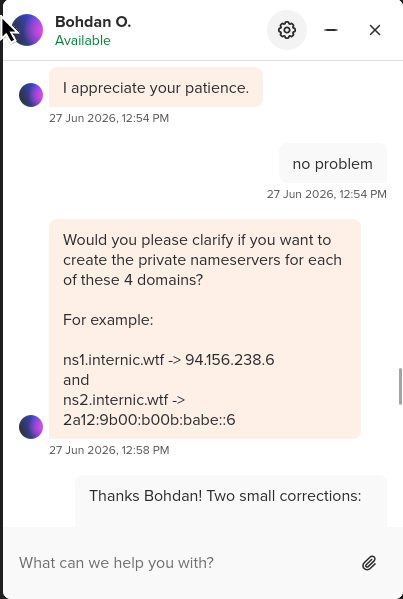
  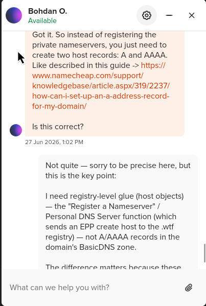
  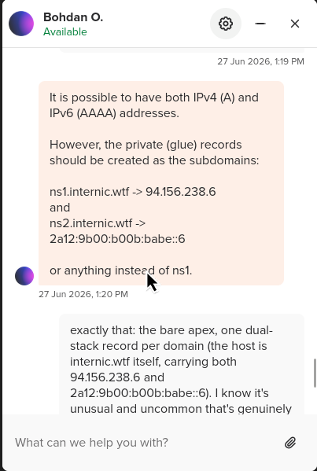
  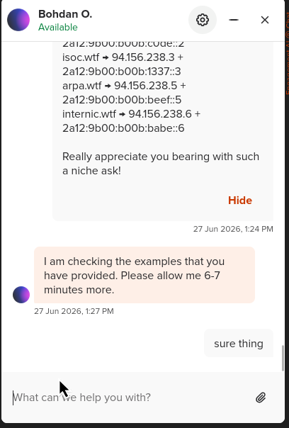
  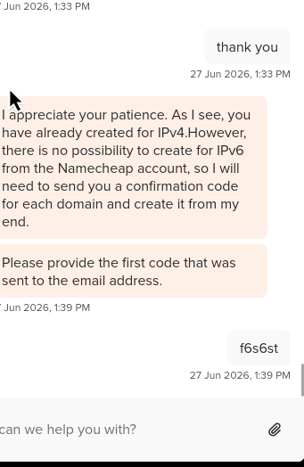
  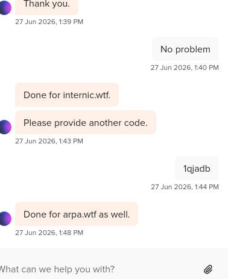
  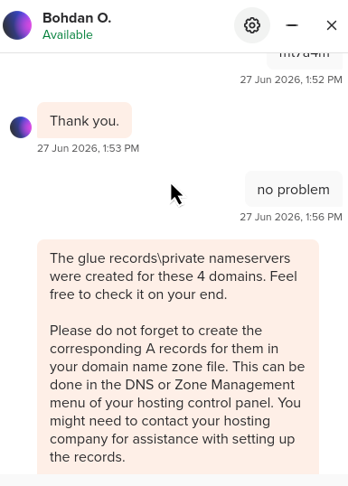
</div>

// or: a complete technical explanation of EPP host objects, apex glue, and why registrar support scripts are not turing complete

i run [AS214806](https://bgp.tools/as/214806) (femboy cyber networks llc). i announce `94.156.238.0/24` and `2a12:9b00:b00b::/48`, and i run my own authoritative anycast DNS on that space. i own a small fleet of `.wtf` domains that exist purely to be nameserver hostnames — `icann.wtf`, `iana.wtf`, `ietf.wtf`, `isoc.wtf`, `arpa.wtf`, `internic.wtf`. yes, this is the funniest possible naming scheme for a DNS platform. no, that's not why support keeps failing me.


<center><a href=https://x.com/vxfemboy/status/2070924026327789989></a></center>

two of those domains are at porkbun. porkbun lets me do this myself — apex, dual-stack glue, straight from the control panel, no ticket required.
four of those domains are at namecheap. i have contacted namecheap support roughly **thirty times** about the same request. they have done this exact operation for me before — it is provably within their capability — and yet every new ticket lands on a fresh rep who has never heard of a host object, and the loop resets.

<center><a href=https://xkcd.com/806></a></center>

on july 4th (fitting), i sent them the most over-engineered escalation email of my life. tables. an xkcd. a literal "SHIBBOLEET" invocation. a section titled "what this is NOT" preemptively closing off every previous misdirect.

the reply i got back is a masterpiece, and i'll get to it. but first, since the entire problem is that nobody in the ticket queue knows what i'm asking for, let me explain — in detail — what a glue record actually is.

## how DNS delegation actually works

when you resolve a name, you walk down a tree. the root servers know who runs `.wtf`. the `.wtf` registry servers know which nameservers are authoritative for `ietf.wtf`. those nameservers answer for everything under the domain.

that middle step — "the `.wtf` zone contains NS records pointing at your nameservers" — is called **delegation**, and it's where things get interesting when your nameserver's hostname lives *inside the zone being delegated*.

say `spam.house` is delegated to `icann.wtf` and `iana.wtf`. a resolver asks the `.house` registry servers for `spam.house`, gets back "go ask `icann.wtf`", and goes off to resolve `icann.wtf`... which requires asking the `.wtf` registry, which is fine, because `.wtf` and `.house` are different zones. no circularity.

but now consider `ietf.wtf` itself. its nameserver is... `ietf.wtf`. a resolver asks `.wtf` "who's authoritative for `ietf.wtf`?" and gets "ask `ietf.wtf`". to ask `ietf.wtf` anything you need its IP address. to get its IP address you have to ask... `ietf.wtf`. congratulations, you have invented a dependency cycle.

**glue records** break the cycle. put precisely: glue records are A/AAAA address records for an *in-bailiwick* nameserver (one inside the zone it serves — or, in this case, one that IS the zone it serves), returned alongside the delegation so a resolver can reach the nameserver without a circular lookup. instead of just handing back the NS name, the parent zone also includes the A and AAAA records in the *additional section* of the referral. name and address in one response, no chicken-and-egg.

this is not exotic — it's exactly how in-bailiwick delegations are supposed to work. `a.root-servers.net` has glue in the root zone; it's how the whole tree bootstraps. the modern, glue-specific spec is [RFC 9471](https://datatracker.ietf.org/doc/rfc9471/): an authoritative server should return the available glue for in-domain nameservers in its referral responses.

## registry vs registrar, and what EPP is

here's the part where support gets lost, so let's be precise about who does what:

the **registry** (for `.wtf`, that's identity digital, née donuts) operates the TLD. they run the authoritative `.wtf` zone. delegation NS records and glue live in *their* database and get published in *their* zone.

the **registrar** (namecheap, porkbun, whoever) is a reseller with an API connection to the registry. that API is **EPP** — the extensible provisioning protocol, [RFC 5730](https://www.rfc-editor.org/rfc/rfc5730) and friends. it's an XML protocol over TLS, and a host is just one of the object types it defines:

- **domain objects** ([RFC 5731](https://www.rfc-editor.org/rfc/rfc5731)) — the registration itself
- **contact objects** ([RFC 5733](https://www.rfc-editor.org/rfc/rfc5733)) — whois/RDAP data
- **host objects** ([RFC 5732](https://www.rfc-editor.org/rfc/rfc5732.html)) — nameservers, provisioned with IPv4/IPv6 addresses that the registry uses to generate glue

when i say "please create apex host objects with glue," the actual operation i'm asking namecheap's provisioning system to fire at the registry is an EPP `host:create`. it looks like this:

```html
<epp xmlns="urn:ietf:params:xml:ns:epp-1.0">
  <command>
    <create>
      <host:create xmlns:host="urn:ietf:params:xml:ns:host-1.0">
        <host:name>ietf.wtf</host:name>
        <host:addr ip="v4">94.156.238.2</host:addr>
        <host:addr ip="v6">2a12:9b00:b00b:c0de::2</host:addr>
      </host:create>
    </create>
  </command>
</epp>
```

that's it. that's the whole request. one XML frame per domain, four domains. the registrar submits it to the registry, which provisions the host object per its own policy; the glue then gets published in the `.wtf` zone. a registrar with a decent control panel exposes this as a self-service form ("register nameserver" / "personal DNS server"). porkbun's does. namecheap [*has* one too](https://www.namecheap.com/support/knowledgebase/article.aspx/768/10/how-do-i-register-personal-nameservers-for-my-domain/) — their own docs confirm personal DNS is created via glue records, with the nameserver name and IP submitted to the registry — but the interface rejects IPv6 addresses and won't take apex hostnames (it insists on `ns1.something.tld`, not `something.tld` itself). whether a registrar surfaces `host:create` to customers at all is a registrar-policy call, not a protocol limit — and namecheap's self-service path, for my case, is a dead end. as far as i can tell the only route left is a human at namecheap firing the EPP call on my behalf. per my own ticket history they've done exactly that for me before — so this isn't hypothetical.

## the specific ask

four `host:create` operations, dual-stack:

| hostname (apex) | IPv4 glue | IPv6 glue |
|---|---|---|
| `ietf.wtf` | `94.156.238.2` | `2a12:9b00:b00b:c0de::2` |
| `isoc.wtf` | `94.156.238.3` | `2a12:9b00:b00b:1337::3` |
| `arpa.wtf` | `94.156.238.5` | `2a12:9b00:b00b:beef::5` |
| `internic.wtf` | `94.156.238.6` | `2a12:9b00:b00b:babe::6` |

// yes the v6 subnets spell things. i pay for the /48, i get to have fun with it.

and to prove the registry supports it — because "the registry doesn't allow that" was one of the previous misdirects — the two porkbun-managed domains already have *identical* apex dual-stack glue, live in the `.wtf` zone right now:

- `icann.wtf` → `94.156.238.1` / `2a12:9b00:b00b:b00b::1`
- `iana.wtf` → `94.156.238.4` / `2a12:9b00:b00b:dead::4`

you can verify this yourself. ask a `.wtf` registry server for the delegation and look at the additional section:

```sh
$ dig @v0n0.nic.wtf icann.wtf NS +norec

;; AUTHORITY SECTION:
icann.wtf.    3600  IN  NS  icann.wtf.

;; ADDITIONAL SECTION:
icann.wtf.    3600  IN  A     94.156.238.1
icann.wtf.    3600  IN  AAAA  2a12:9b00:b00b:b00b::1
```

that additional section IS the glue. same registry, same TLD, same IP space, same account holder. `spam.house` is delegated to these nameservers with DNSSEC and resolves flawlessly. the only variable is which registrar sits between me and the EPP endpoint.

<center></center>

## what i preemptively ruled out, in writing

because i've been through this loop ~30 times, my escalation email contained an explicit "what this is NOT" section:

- ❌ not A/AAAA records inside my zone — those exist, they're irrelevant, the zone's contents can't bootstrap the zone's own delegation
- ❌ not a subdomain nameserver like `ns1.ietf.wtf` — the hostname must be the apex
- ❌ not solvable via the self-service nameserver registration tool or API — it rejects IPv6 and won't take apex hosts

i cited the working porkbun precedent. i offered to complete any per-domain email confirmation, ownership verification, DNSSEC proof, whatever their process requires. i asked, in bold, for the ticket to be routed to whoever operates their EPP connection to the registry.

## the reply

forty-two minutes later, a human responded. i want to be clear that i don't blame the individual rep — this is a systems failure, not a person failure — but the response deserves preservation:

<center></center>

> 1) EPP code is used only for the domain transfer. If you wish to manage the domain with us, you do not need the EPP code;

i asked about EPP `host:create` — the provisioning protocol — and the pattern-matcher latched onto "EPP" and retrieved the only meaning of it in the support script: the *EPP auth code*, aka transfer authorization code, the little secret string you use to move a domain to another registrar. entirely different thing that happens to share three letters.

it gets better. the reply then helpfully linked me to the knowledge base article for **transferring my domains away from namecheap**, complete with instructions for unlocking the domain and retrieving the auth code.

i sent a detailed technical escalation asking namecheap to perform a registry operation, and namecheap support responded with instructions for how to stop being a namecheap customer. as a bonus, the reply opened with "we do not support check record configuration" — i genuinely do not know what a "check record" is, and i say that as someone who runs an LIR. i suspect it's a typo of "such record," which would at least be a coherent (wrong) sentence.

// the xkcd shibboleet reference in my email was supposed to be a joke. it has become documentary.

## why this keeps happening

the failure mode is structural. tier-1 registrar support is optimized for the 99.9% case: DNS records in the hosted zone, transfers, renewals, whois. the script has no branch for "registry host object operations," so anything containing the string "EPP" gets snapped to the nearest script entry, which is transfers. escalation requests get answered by the same tier that can't parse the request, so asking to escalate doesn't escalate — it just re-rolls the rep.

porkbun doesn't even make you open a ticket — its control panel exposes apex, dual-stack glue as a self-service option, so i set it up myself in a couple of minutes. namecheap *can* do it too — they've done it for me before, and their EPP pipe to identity digital demonstrably works — but their self-service form won't take apex hosts or IPv6, and there's no reliable path from the inbox to the person who holds the keys.

the deep irony is that glue records are the oldest, most foundational thing here. this isn't some bleeding-edge feature request. delegation and glue go back to [RFC 1034](https://www.rfc-editor.org/rfc/rfc1034) in *1987*, with the glue-in-referral behavior tightened in [RFC 9471](https://datatracker.ietf.org/doc/rfc9471/) (2023); the EPP host mapping that models it, [RFC 5732](https://www.rfc-editor.org/rfc/rfc5732.html), has been an IETF standard since 2009. i am asking a domain registrar to perform the single most fundamental registrar operation that exists after "register domain," and i've been asking for long enough that i've written a blog post instead of a follow-up email.

## current status

- ticket NC-LER-4847: open, orbiting
- attempts: ~30
- working glue at the other registrar (porkbun): 2/2 domains, self-service, zero tickets
- working glue at namecheap: 0/4 domains
- knowledge base articles received about leaving namecheap: 1

if anyone at namecheap with EPP access reads this: the `host:create` frames are in the post. the table is in the post. i will confirm any authorization email within minutes. i just want my glue.

and if you're wondering whether i'm going to take their accidental advice and transfer the domains to porkbun: the thought has occurred to me, yes.

---

## references

the ranting is mine; the technical claims lean on standards and vendor docs, not vibes:

- [RFC 9471](https://datatracker.ietf.org/doc/rfc9471/) — DNS glue requirements in referral responses (the modern, glue-specific spec)
- [RFC 1034](https://www.rfc-editor.org/rfc/rfc1034) — the original DNS delegation model
- [RFC 5730](https://www.rfc-editor.org/rfc/rfc5730) — EPP, the base registry provisioning protocol
- [RFC 5732](https://www.rfc-editor.org/rfc/rfc5732.html) — EPP host mapping (`<host:create>`, `<host:addr>`, glue)
- [RFC 5731](https://www.rfc-editor.org/rfc/rfc5731) — EPP domain mapping
- [RFC 5733](https://www.rfc-editor.org/rfc/rfc5733) — EPP contact mapping
- [Namecheap KB — register personal nameservers](https://www.namecheap.com/support/knowledgebase/article.aspx/768/10/how-do-i-register-personal-nameservers-for-my-domain/) — their own docs: personal DNS is created via glue records, name + IP submitted to the registry, IPv6 needs support
- [AFNIC — DNS records: a sticky subject](https://www.afnic.fr/en/observatory-and-resources/expert-papers/dns-records-a-sticky-subject/) — plain-language glue explainer (the circular-dependency framing)
- [DNSimple — what are glue records?](https://support.dnsimple.com/articles/what-are-glue-records/) — glue as A/AAAA for in-zone nameservers, returned with the NS delegation
- [IBM — glue records](https://www.ibm.com/think/topics/glue-records) — glue in the additional section and why it avoids circular resolution

the ticket history, the quoted support reply, and the live `.wtf` glue are first-party — the screenshots up top are the receipts.
